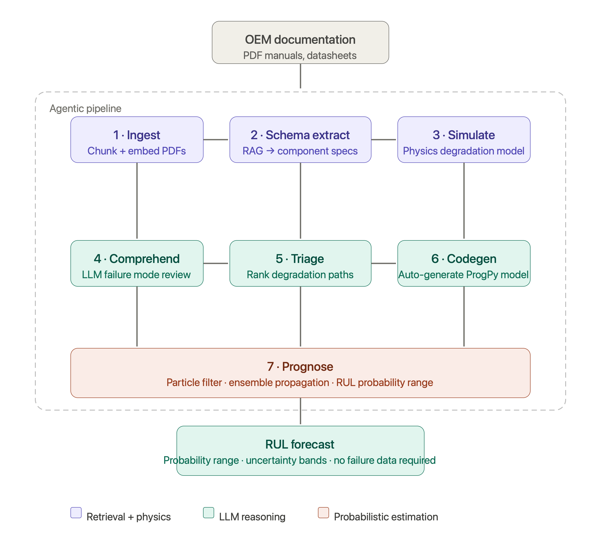
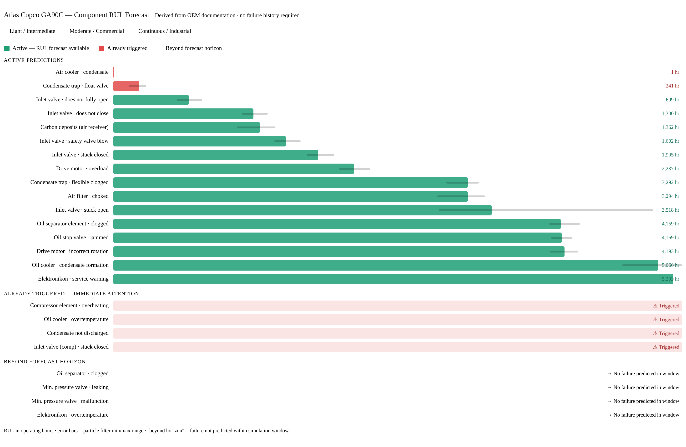

# Kaful — Prognostic Digital Twins for Industrial Equipment

> **Physics-grounded remaining-useful-life forecasts from OEM documentation. No historical failure data required.**

[kaful.ai](https://kaful.ai) · [Live demo](https://buchbindern.github.io/kaful-showcase/)

---

## The problem

Most industrial equipment fails unpredictably. Predictive maintenance exists to solve this — but nearly every approach requires years of historical failure data to train on. Small and mid-sized manufacturers don't have that data. A new machine has no failure history. A one-off production line has no peer fleet to borrow from.

Meanwhile, the physics needed to model how a machine degrades is already written down. It's in the OEM manual, the datasheet, the service interval table. It's just locked in PDFs.

## What Kaful does

Kaful automatically generates a **physics-grounded prognostic digital twin** for industrial equipment directly from OEM documentation — without requiring historical failure data.

Given a machine's technical manuals, Kaful:

1. Extracts component specs, degradation physics, and failure modes using retrieval-grounded LLM extraction
2. Constructs a physics-based simulation of the machine's degradation over time
3. Propagates that model forward with Monte Carlo uncertainty to produce a **RUL forecast with a calibrated uncertainty band** — not a single number

The result is a component-level failure forecast a maintenance engineer can act on, generated from documentation that already exists.

## Architecture

The pipeline runs as an **agentic system** — seven autonomous stages, each feeding the next:

| Stage | What happens |
| --- | --- |
| **Ingest** | OEM PDFs are chunked, embedded, and indexed for retrieval |
| **Schema extract** | RAG + LLM pulls component specs, tolerances, and service intervals |
| **Simulate** | Physics-based degradation model is constructed from extracted specs |
| **Comprehend** | LLM reviews the simulation against known failure modes from the manual |
| **Triage** | Failure paths are ranked by severity and likelihood |
| **Codegen** | ProgPy degradation model is auto-generated from the triage output |
| **Prognose** | The composite model is propagated forward; outputs a per-component RUL forecast with an uncertainty band |

The agentic framing is deliberate: the architecture is designed to minimize manual configuration per machine type. Each machine built so far required calibration validation against the source documentation — the goal is to reduce that to zero as the pipeline matures.

## Try it — live

**[Interactive demo — CNC spindle](https://buchbindern.github.io/kaful-showcase/)**

Set hours run, operating intensity, and environment, and watch component-level remaining useful life update across the spindle's front and rear bearings, tool interface, position coder, and drive amplifier. Each component is colored by health and annotated with its RUL and a ±2σ uncertainty band.

Every number on the page is the twin's own output — the Kaful pipeline generated this spindle model from the OEM manual, and the demo evaluates that model's degradation trajectory across a grid of operating intensities and environments. Nothing is interpolated or mocked: each operating point is a real run of the physics model, and remaining useful life for any number of run-hours is read directly from the model's threshold-crossing times.

### How the demo works

Under a fixed operating profile the composite model is deterministic, so a single forward trajectory to the 10,000-hour horizon yields every component's threshold-crossing time. RUL is simply that crossing time minus the hours already run — which is why the hours control updates instantly with no recomputation. The full Monte Carlo distribution this would otherwise require turns out to be a narrow band around that trajectory, so it's captured as a ±2σ interval from a per-event coefficient of variation calibrated on the model's process noise. The operating grid is evaluated ahead of time, so the live page needs no backend at all.

Of the spindle's modeled components, two (the spindle motor and temperature sensor) do not reach a failure threshold within the horizon under nominal operation and are omitted from the diagram rather than shown permanently healthy.

## Worked example — Atlas Copco GA90C air compressor

The GA90C is a 90kW rotary screw industrial air compressor, a common fixture in manufacturing plants. Kaful ingested the Atlas Copco GA55-90C instruction book and Compressed Air Manual (9th edition) and produced component-level RUL forecasts across three usage profiles — with no GA90C failure data used at any point.

### RUL dashboard (three usage profiles)

The same compressor, the same OEM manual, three completely different risk profiles depending on how it's operated:

- **Continuous / industrial** — nearly all components triggered or imminent; air filter at 2 hrs, air cooler at 7 hrs
- **Moderate / commercial** — mixed picture; air filter at ~400 hrs, several components already triggered
- **Light / intermediate** — longest horizon; air filter at ~3,300 hrs, Elektronikon service warning at ~5,200 hrs

Each forecast includes a **Monte Carlo uncertainty range** (min/max across the ensemble), not just a point estimate. The width of that range reflects the physics of the component — a condensate trap float valve has a wider uncertainty band than an oil stop valve because its degradation is more sensitive to operating variability.

### Sample predictions (light / intermediate profile)

| Component | RUL mean (hrs) | Range (hrs) | Std |
| --- | --- | --- | --- |
| Elektronikon · service warning | 5,202 | 5,202–5,203 | 0.5 |
| Oil cooler · condensate formation | 5,066 | 4,730–5,287 | 136 |
| Drive motor · incorrect rotation | 4,193 | 4,058–4,318 | 69 |
| Oil stop valve · jammed | 4,169 | 4,068–4,262 | 52 |
| Oil separator element · clogged | 4,159 | 4,052–4,334 | 63 |
| Inlet valve · stuck open | 3,518 | 3,026–5,019 | 327 |
| Air filter · choked | 3,294 | 3,013–3,453 | 73 |
| Condensate trap · flexible clogged | 3,292 | 3,096–3,398 | 74 |
| Inlet valve · safety valve blow | 1,602 | 1,496–1,741 | 62 |
| Condensate trap · float valve | 241 | 140–306 | 37 |
| Air cooler · condensate | 1 | 1–1 | 0 |

## Machines built

| Machine | OEM source |
| --- | --- |
| CNC spindle (Fanuc/NSK-class) | Spindle drive + precision-bearing documentation |
| Atlas Copco GA90C air compressor | GA55-90C instruction book + Compressed Air Manual 9th ed. |
| Eversys e'4s espresso machine | Full technical manual |
| Tempress LPCVD semiconductor furnace | University of Arizona NanoFab documentation (11 files) |

## Tech

**ML / prognostics:** Python · NASA ProgPy · Monte Carlo prognostics · forward uncertainty propagation

**Extraction:** RAG over OEM PDFs · LLM-driven schema extraction · retrieval-grounded comprehension

**Physics simulation:** component-level degradation models · physics-based event normalization

**Demo:** static HTML / SVG / vanilla JS over precomputed model output — no backend

## Presented at

IWSM 2026 — International Workshop on Software Measurement, American University, Washington DC.
Poster: *Physics-grounded prognostic digital twins from OEM documentation.*

## Further reading

- [Technical approach](docs/technical-approach.md) — pipeline design decisions, why physics-first, why forward Monte Carlo
- [Product notes](docs/product-notes.md) — what Kaful is, who it's for, where it's going
- [Sample data schema](demo/sample-data-schema.md) — input/output format

---

*Source code is proprietary. This repository documents the approach, architecture, and results.*